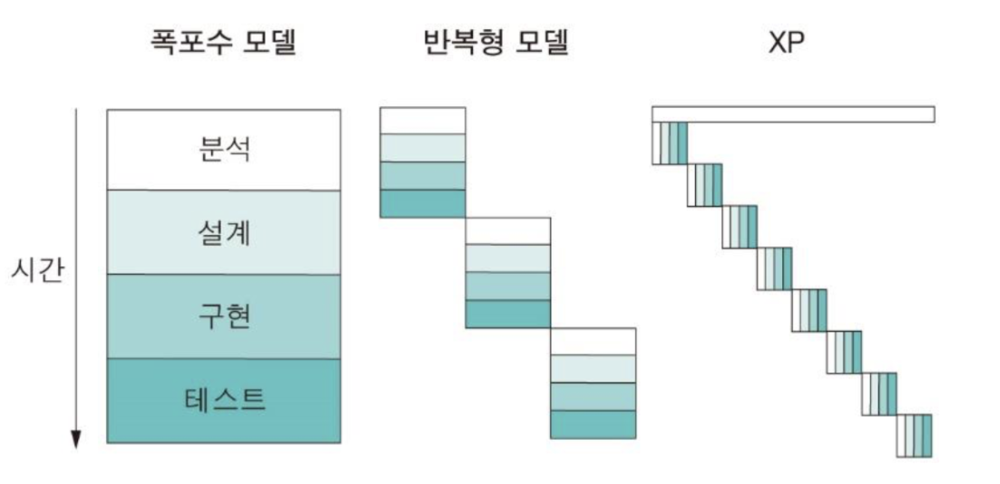

# **소프트웨어공학** 

## 소프트웨어?

- 하드웨어를 동작시켜 사용자가 작업을 편리하게 수행하도록 하는 프로그램과 자료 구조 등을 총 칭합니다.
- 소프트웨어는 프로그램 자체 뿐만 아니라 프로그램의 개발, 운용 및 유지보수에 관련된 모든 정보를 포함합니다.

## 소프트웨어 특성

- ### 비가시성

  - 소프트웨어 구조는 외관으로 나타나지 않고 코드로 숨어 있다.
  - 구조가 외부에 노출되지 않고 코드에 내재되어 있음(개념적, 무형적)

- ### 복잡성

  - 개발과정이 복잡, 비표준화
  - 정형적 구조가 없이 복잡하고 비규칙적, 비정규적임

- ### 비마모성

  - 외부의 환경에 의해 마모되지 않고 다만 품질이 나빠질 뿐임
  - 마모되거나 소멸되지 않는다.
  - 소프트웨어는 하드웨어와 달리 마모되지 않고 품질이 저하되는 특징이 있다.

- ### 복제성(Duplicability)

  - 적은 비용(무상)으로 간단하고 쉽게 다양한 경로와 노력으로 복제가 가능

- ### 변경성(Changeability)

  - 필요에 따라 항상 수정이 가능한 진화

- ### 순응성(Comformity)

  - 사용자요구, 환경변화에 적절히 변형가능

- ### 무형성(Intangible)

  - 사실 형제가 없으며 FP(기능점수)등으로 유형화 하고자 함

- ### 비제조성

  - 하드웨어처럼 제작이 아니라 논리적인 절차에 맞게 개발
  - 소프트웨어는 제조, 생산 되어지는 것이 아니라 개발되어진다.
    하드웨어와 같이 소프트웨어도 좋은 설계를 바탕으로 만들어지지만 생상과정이 품질에 큰 영향을 주지는 않는 하드웨어에 비해 소프트웨어 개발과정은 그 과정 자체가 곧 품질로 연결된다.

- ### 동적행위성(動的行爲性)

  - 프로그램은 정적인 반면 소프트웨어는 정적이다.
  - 프로그램이 하드웨어에 의해 수행되고 사용자와 상호작용할 때 비로소 소프트웨어가 된다.

- ### 상품성(商品性)

  - 개발된 소프트웨어는 상품화되어 판매된다.
  - 개발된 프로그램은 제품에 불과하고 포장이 되고 사용자가 사용할 가치가 생기므로써 상품이된다.

- ### 견고성(堅固性)

  - 일부 수정으로 소프트웨어 전체에 영향을 줄 수 있다.
  - 소프트웨어의 행위는 예측이 어렵고 수정이 용이하지 않다.
  - 따라서 소프트웨어가 한번 구조성을 잃으면 유지보수는 점점 어려워지므로 ‘소프트’라는 단어 처럼 그리 유연하지 못하다는 것이다.

- ### 비조립성

  - 하드웨어는 부품의 조립으로 이루어지는 반면 소프트웨어는 대부분의 경우에 개발에 머물뿐 조립의 단계는 아직 아니다.

- ### 비과학성

  - 과학적이 아니라 조직, 인력, 시간, 절차 등 중심
  - 소프트웨어 개발 자체는 수학적이거나 과학적인 것이 아니라 조직, 인력, 시간, 비용, 절차 등이 중심이되는 관리기술이 중요하다.

 

**비가시성**
소프트웨어는 기존의 타 종류 제품들과 달리 눈에 보이지 않는다는 특성을 갖습니다. 왜냐하면 소프트웨어의 가장 큰 비중을 차지하는 프로그램은 그 형태가 존재하지 않고 하드웨어에서 작동하기 때문입니다.

**복잡성**
소프트웨어는 그 자체로 매우 복잡할 뿐 아니라 만드는 방법과 과정 또한 매우 복잡합니다. 컴퓨터가 만들어진 초창기에 비해 소프트웨어는 나날이 복잡해지고 있습니다. 사용자들이 원하는 기능들이 많아질 뿐만 아니라 단일 기능 그 자체도 복잡해지고 있기 때문입니다. 그러한 과정에서 소프트웨어를 만드는 방법 또한 복잡해졌습니다.

**비마모성**
소프트웨어는 눈에 보이는 타종류의 제품들과 달리 마모되지 않는다는 특성을 갖습니다. 하드웨어가 손상되지 않는 한 소프트웨어는 계속해서 작동할 수 있습니다.

**복제 가능**
소프트웨어는 복사할 수 있습니다. 이것은 이미 많은 사람들이 경험해 온 것이죠. 컴퓨터가 있고 저장 장치의 용량이 충분하다면, 소프트웨어를 복사한다는 것은 매우 쉬운 일입니다.

**테스트 및 변경 가능**
소프트웨어는 개발 과정에서 뿐만 아니라 출시 후에도 테스트가 진행 됩니다. 그리고 문제가 발생하면, 언제든 그것은 수정될 수 있습니다. 많은 사람들이 즐기고 있는 온라인 게임들이 그렇습니다. 사용자들이 게임을 하다보면 오류들을 만나게 되지요. 그러면 그들은 개발사에 수정을 요구합니다. 회사는 이들을 수정하고, 패치를 발표합니다.

**비제조성**
일반적으로 제품을 생산하기 위해서는 별도의 생산 시설이 필요합니다. 그러나 소프트웨어는 컴퓨터만 있으면 개발이 가능합니다. (물론 임베디드 소프트웨어의 경우는 얘기가 다르지요.) 이 때문에 소프트웨어를 개발하기 위해 무엇보다 필요한 것은 두뇌력입니다.

**순응성**
소프트웨어는 한 번 출시로 끝나지 않습니다. 사용자들은 소프트웨어를 사용하면서 기존 기능의 수정과 새로운 기능의 구현을 요구합니다. 소프트웨어는 사용자들의 요구에 따라 계속해서 변화합니다. 시간이 지나면서 하드웨어도 바뀌지요. 소프트웨어는 바뀌는 하드웨어에 최적화될 수 있도록 변화해야 합니다.

## 소프트웨어 개발 방법론 - 에자일(Agile)

- 변화를 수용하고 협업과 제품의 빠른 인도를 강조하는 **반복적** 개발방법

- 요구사항의 변화는 불가피하고 이에 대응하는 것이 현실적 --> 환경의 빠른 변화에 대응하는 것이 중요!

- 문서화보다 코드/프로그램/소프트웨어 자체를 중요하게 생각

- ### 에자일 선언문

  - 공정과 도구보다 개인과의 상호작용을
  - 포괄적인 문서보다 작동하는 소프트웨어를
  - 계약 협상보다 고객과의 협력을
  - 계획을 따르기보다 변화에 대응하기를

- ### 에자일 방법론의 종류

  - 익스트림 프로그래밍
    - 
    - 작고 빈번한 릴리즈 --> 빠른 피드백과 지속적인 개선 --> 고객도 개발 팀의 일원
    - 프로세스 중심이 아닌 사람 중심의 작업
    - 단순한 설계와 테스트 주도 개발 (Test Driven Development)
    - 리팩토링을 통한 코드 품질 개선

  

  - 짝 프로그래밍 (Pair Programming)

    - 두 사람이 짝이 되어 한 사람이 코딩, 다른 사람은 검사를 수행
    - 30분마다 역할 교체

    

  - 테스트 주도 개발 (Test Driven Development)

    - 테스트케이스를 먼저 작성하고 이를 통과하는 코드를 개발
    - Task별로 테스트케이스를 만든다.
    - 통합 테스트를 강조하여 통합 과정에서 기존 소프트웨어의 오류 유입을 방지

    

  - 스크럼(Scrum)

    - 솔루션에 포함할 기능에 대한 우선순위 부여

    - 개발 주기는 30일정도, 개발 주기마다 실제 동작할 수 있는 결과를 제공하는게 목적

    - 날마다 15분 정도의 회의

    - **스크럼의 진행 과정**
      스크럼에서는, 30일간의 주기로 실제 동작하는 제품을 만들면서 개발을 진행시킨다.

      1. 제품에서 요구하는 기능과 우선순위를 제품 백로그로 정한다.
      2. PO(Project Owner, 제품 책임자)가 정한 제품의 우선순위에서 어디까지 작업을 할지 팀과 조율 한다.

      3. 조율하여 선정된 제품 백로그가 이번 스프린트의 목표가 된다.

      4. 스프린트 목표를 구현 가능 하도록 팀에서 스프린트 백로그를 작성한 뒤 작업을 할당한다.

      5. 스프린트를 진행하는 동안, 매일 정해진 장소와 시간에 모든 개발 팀원이 참여하는 일일 스크럼 회의를 가진다.

      6. 매회의 스프린트가 종료할 때마다, 스프린트 리뷰 미팅을 통해 만들어진 제품을 학습하고 이해 한다.

      7. 제품의 학습과 이해가 끝나면, 스프린트 회고를 통해 팀의 개발 프로세스에 대한 개선의 시간을 갖는다.

      8. 스프린트 기간 중 다음 스프린트를 준비 하기 위해 PO와 필요 인원이 모여 백로그를 준비하는 시간을 갖는다.

-----

### 출처

----

[소프트웨어, 소프트웨어의 특성](https://goodgid.github.io/SoftWare-Feature/)

[소프트웨어의 특성](https://m.blog.naver.com/PostView.naver?isHttpsRedirect=true&blogId=netrance&logNo=110137931133)

[에자일 방법론](https://atoz-develop.tistory.com/entry/%EC%86%8C%ED%94%84%ED%8A%B8%EC%9B%A8%EC%96%B4-%EA%B0%9C%EB%B0%9C-%EB%B0%A9%EB%B2%95%EB%A1%A0-%EC%95%A0%EC%9E%90%EC%9D%BCAgile-%EB%B0%A9%EB%B2%95%EB%A1%A0)

